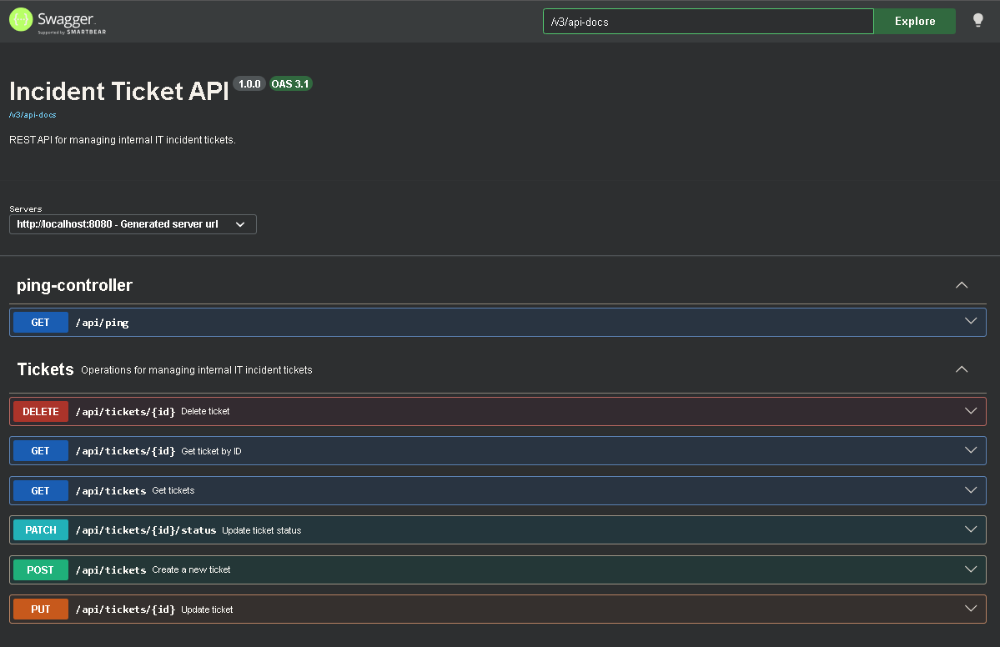
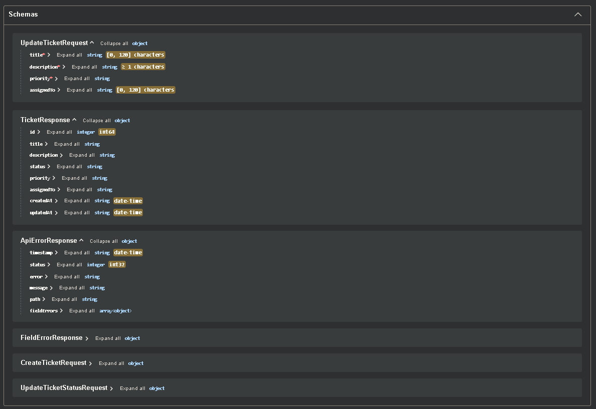
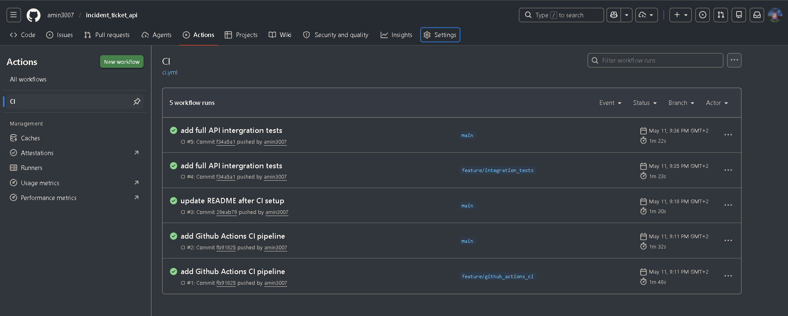
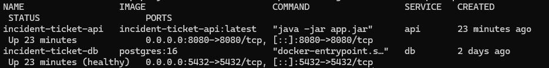

# Incident Ticket API

A backend portfolio project for managing internal IT incident tickets through a REST API.

The project demonstrates practical backend development with Spring Boot, PostgreSQL, layered architecture, validation, automated tests, centralized error handling, OpenAPI documentation, operational health checks, Docker, Docker Compose, GitHub Actions CI, and full API integration testing.

## Tech Stack

- Java 21
- Spring Boot
- Spring Web
- Spring Data JPA
- Hibernate
- PostgreSQL
- Maven
- Jakarta Validation
- Spring Boot Actuator
- springdoc-openapi
- Docker
- Docker Compose
- GitHub Actions
- JUnit, Mockito, AssertJ, MockMvc

## Key Features

- REST API for incident ticket management
- PostgreSQL persistence with JPA entity mapping
- Layered backend architecture: Controller, Service, Repository, DTOs, Mapper
- Request validation with Jakarta Validation
- Centralized JSON error handling
- OpenAPI documentation with Swagger UI
- Actuator health, info, metrics, liveness and readiness endpoints
- Custom health indicator for the ticket repository
- Dockerfile for containerized application startup
- Docker Compose setup for API and PostgreSQL
- GitHub Actions CI pipeline for build, tests, Compose validation and Docker image build
- Full API integration test covering the complete ticket lifecycle

## Screenshots

### Swagger UI




### GitHub Actions CI



### Docker Compose Runtime



## Architecture

```text
Client / Swagger UI / API Consumer
        |
        v
TicketController
        |
        v
TicketService
        |
        v
TicketRepository
        |
        v
PostgreSQL
```

Runtime with Docker Compose:

```text
Docker Compose
  |
  |-- api service
  |     Spring Boot application
  |     Port: 8080
  |
  |-- db service
        PostgreSQL
        Port: 5432
        Volume: postgres_data
```

Main package:

```text
com.example.incident_ticket_api
```

## Data Model

The central entity is `Ticket`.

```text
id
title
description
status
priority
assignedTo
createdAt
updatedAt
```

Ticket status values:

```text
OPEN
IN_PROGRESS
RESOLVED
CLOSED
```

Ticket priority values:

```text
LOW
MEDIUM
HIGH
CRITICAL
```

New tickets start with status `OPEN`.

## REST API

Implemented endpoints:

```text
POST   /api/tickets
GET    /api/tickets
GET    /api/tickets/{id}
PUT    /api/tickets/{id}
PATCH  /api/tickets/{id}/status
DELETE /api/tickets/{id}

GET    /api/tickets?status=OPEN
GET    /api/tickets?priority=HIGH
GET    /api/tickets?status=OPEN&priority=HIGH
```

## Example Request

```http
POST /api/tickets
Content-Type: application/json
```

```json
{
  "title": "Login not working",
  "description": "A user cannot log in to the internal dashboard.",
  "priority": "HIGH",
  "assignedTo": "IT Support"
}
```

## Example Response

```json
{
  "id": 1,
  "title": "Login not working",
  "description": "A user cannot log in to the internal dashboard.",
  "status": "OPEN",
  "priority": "HIGH",
  "assignedTo": "IT Support",
  "createdAt": "2026-05-09T10:00:00",
  "updatedAt": "2026-05-09T10:00:00"
}
```

## Error Handling

The API uses centralized error handling with `GlobalExceptionHandler`.

Handled error cases:

- Missing ticket returns `404 Not Found`
- Validation errors return `400 Bad Request`
- Malformed JSON returns `400 Bad Request`
- Invalid enum values return `400 Bad Request`
- Invalid query parameters return `400 Bad Request`
- Unexpected internal errors return `500 Internal Server Error`

Example error response:

```json
{
  "timestamp": "2026-05-09T12:30:00",
  "status": 400,
  "error": "Bad Request",
  "message": "Validation failed",
  "path": "/api/tickets",
  "fieldErrors": [
    {
      "field": "title",
      "message": "Title must not be blank"
    }
  ]
}
```

## OpenAPI Documentation

Swagger UI:

```text
http://localhost:8080/swagger-ui.html
```

OpenAPI JSON:

```text
http://localhost:8080/v3/api-docs
```

OpenAPI YAML:

```text
http://localhost:8080/v3/api-docs.yaml
```

## Operational Endpoints

The application uses Spring Boot Actuator for operational checks.

```text
http://localhost:8080/actuator/health
http://localhost:8080/actuator/info
http://localhost:8080/actuator/metrics
http://localhost:8080/actuator/health/liveness
http://localhost:8080/actuator/health/readiness
http://localhost:8080/livez
http://localhost:8080/readyz
```

The health endpoint includes application health, database health, disk space health and a custom ticket repository health check.

## Environment Configuration

Create a local `.env` file from the example file:

```bash
cp .env.example .env
```

On Windows PowerShell:

```powershell
Copy-Item .env.example .env
```

Example values:

```properties
POSTGRES_DB=incident_ticket_db
POSTGRES_USER=incident_user
POSTGRES_PASSWORD=incident_password

SPRING_DATASOURCE_URL=jdbc:postgresql://db:5432/incident_ticket_db
SPRING_DATASOURCE_USERNAME=incident_user
SPRING_DATASOURCE_PASSWORD=incident_password
```

The local `.env` file should not be committed.

## Run with Docker Compose

Build and start the full local stack:

```bash
docker compose up --build
```

Run in detached mode:

```bash
docker compose up --build -d
```

Check running services:

```bash
docker compose ps
```

View logs:

```bash
docker compose logs api
docker compose logs db
```

Stop the stack:

```bash
docker compose down
```

Stop the stack and remove the database volume:

```bash
docker compose down -v
```

Docker Compose starts:

- Spring Boot API
- PostgreSQL database
- Persistent PostgreSQL volume
- Internal Docker network

The API connects to PostgreSQL through the Compose service name:

```text
db
```

## Run Locally with Maven

Start PostgreSQL first:

```bash
docker compose up -d db
```

Then start the application:

```bash
./mvnw spring-boot:run
```

On Windows PowerShell:

```powershell
.\mvnw.cmd spring-boot:run
```

The application runs on:

```text
http://localhost:8080
```

## Tests

Repository and integration tests require a running PostgreSQL database.

Start PostgreSQL before running tests locally:

```bash
docker compose up -d db
```

Run all tests:

```bash
./mvnw test
```

On Windows PowerShell:

```powershell
docker compose up -d db
.\mvnw.cmd test
```

Implemented test areas:

- Repository tests
- DTO validation tests
- Mapper tests
- Service unit tests
- Controller tests
- Error handling tests
- Health indicator tests
- Full API integration tests

The full API integration test verifies:

1. Create ticket
2. Read ticket by ID
3. Update ticket
4. Update ticket status
5. Filter tickets
6. Delete ticket
7. Verify `404 Not Found` response after deletion

## Continuous Integration

The project uses GitHub Actions for continuous integration.

The CI pipeline performs:

- Java 21 setup
- Maven dependency caching
- PostgreSQL service container startup
- Maven build and tests
- Docker Compose configuration validation
- Docker image build

Workflow file:

```text
.github/workflows/ci.yml
```

## Project Structure

```text
src
  main
    java
      com
        example
          incident_ticket_api
            config
            controller
            dto
            exception
            health
            mapper
            model
            repository
            service
    resources
      application.properties
  test
    java
      com
        example
          incident_ticket_api
            controller
            dto
            health
            integration
            mapper
            repository
            service
.github
  workflows
    ci.yml
docs
  diagrams
    architecture.md
  screenshots
    swagger-ui.png
    github-actions-ci.png
    docker-compose.png
    actuator-health.png
compose.yaml
.env.example
Dockerfile
.dockerignore
pom.xml
README.md
```

## Project Status

Implemented:

- REST API
- PostgreSQL persistence
- Validation
- Centralized error handling
- OpenAPI and Swagger UI
- Actuator health checks
- Dockerfile
- Docker Compose
- GitHub Actions CI
- Full API integration tests

Potential next steps:

- Add authentication and role-based access control
- Add pagination and sorting
- Add database migration tool such as Flyway or Liquibase
- Add frontend dashboard